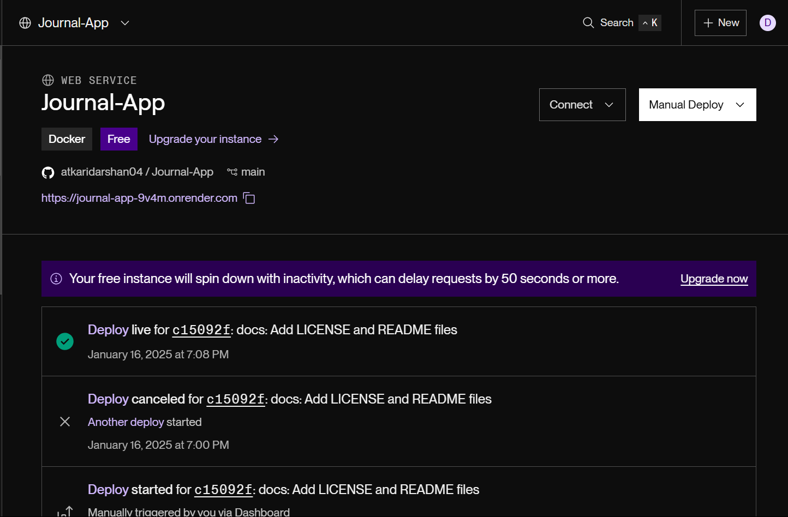
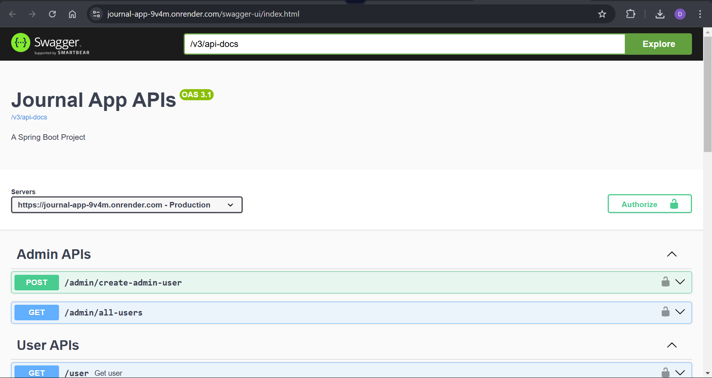

# Journal App

## Overview
The Journal App is a Spring Boot based application designed for managing journal entries with additional features such as user authentication, weather integration, and caching for performance optimization.

---

## Features

- **User Authentication**: Secure login with JWT-based authentication.
- **Journal Management**: Create, read, update, and delete journal entries.
- **Weather Integration**: Fetch weather data (Form external APIs).
- **Caching**: Utilizes Redis for faster access to frequently used data.
- **API Documentation**: Built-in Swagger integration for API testing and exploration.
- **Scheduler**: Automated background jobs for cache cleanup or email sending.
- **Global Exception Handling**: Ensures consistent error responses.

---

## Tech Stack

- **Backend**: Java, Spring Boot
- **Database**: MongoDB
- **Caching**: Redis
- **API Documentation**: Swagger
- **Containerization**: Docker
- **Build Tool**: Maven

---

## Prerequisites

- Java 17+
- Maven 3.8+
- Docker (optional for containerized deployment)
- Redis server
- MongoDB server

---

## Project Structure

```
Journal-App
├── src
│   ├── main
│   │   ├── java/com/project
│   │   │   ├── api/response
│   │   │   ├── cache
│   │   │   ├── config
│   │   │   ├── controllers
│   │   │   ├── dto
│   │   │   ├── entities
│   │   │   ├── exceptions
│   │   │   ├── filters
│   │   │   ├── repositories
│   │   │   ├── scheduler
│   │   │   ├── services
│   │   │   ├── utils
│   │   ├── resources
│   │       ├── application.yml
│   │       ├── logback.xml
│   ├── test
│       ├── java/com/project
│           ├── JournalApp
│           ├── repositories
│           ├── schedulers
│           ├── services
├── Dockerfile
├── pom.xml
└── sample.env
```

---

## Setup and Installation

1. **Clone the Repository**
   ```bash
   git clone https://github.com/atkaridarshan04/Journal-App.git
   cd Journal-App
   ```

2. **Add Environment Variables**
    - Ensure all necessary variables are set in the `application.yml` file.

3. **Build the Application**
   ```bash
   ./mvnw clean install -DskipTests=true
   ```

4. **Run the Application**
   ```bash
   java -jar target/JournalApp/target/filename-version-SNAPSHOT.jar
   ```

5. **Access Swagger UI**
    - Open your browser and navigate to `http://localhost:8080/swagger-ui.html`.

---

## Docker Deployment

1. **Configure Environment Variables**
    - Create a `.env` file based on `sample.env` and set the necessary variables.

2. **Build Docker Image**
   ```bash
   docker build -t journal-app .
   ```

3. **Run Docker Container**
   ```bash
   docker run -p 8080:8080 --env-file=.env --name JournalApp journal-app
   ```

---

## Deployment

The project is successfully deployed on Render. You can access the Swagger API documentation here:

[Swagger UI - Deployed Application](https://journal-app-9v4m.onrender.com/swagger-ui/index.html)
    
    
---

## Key Classes and Functionalities

- **Controllers**:
    - `UserController`: Handles user-related operations.
    - `JournalController`: Manages journal entries.
    - `PublicController`: Handles non-authenticated endpoints.

- **Services**:
    - `UserService`: Business logic for user management.
    - `JournalService`: Core logic for journal operations.
    - `WeatherService`: Integration with external weather APIs (Weather Stack).

- **Configuration**:
    - `SpringSecurityConfig`: Secures application endpoints.
    - `RedisConfig`: Configures Redis caching.
    - `SwaggerConfig`: Enables API documentation.

- **Utilities**:
    - `JwtUtil`: Handles JWT token creation and validation.

---

## Testing

- Run unit tests using Maven:
  ```bash
  ./mvnw test
  ```

- Includes test cases for:
    - Repository methods
    - Service layer logic
    - Scheduler functionality

---

## License

This project is licensed under the [MIT License](./LICENSE). See the LICENSE file for details.

---

